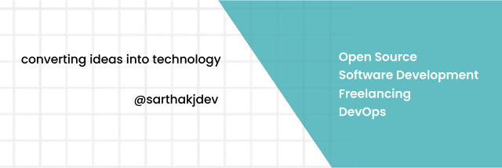

  

<h1 align="center">👋 Hello, I'm Sarthak Jain</h1>
<h3 align="center">🔧 Backend & DevOps Engineer | Freelancer 🚀</h3>

  🌐 <a href="https://sarthakjdev.com/">Portfolio</a> 
  💬 Ask me about JS, TS, Web, Backend and DevOps 
  📫 Reach out: <a href="mailto:contact.sarthakjain@gmail.com">contact.sarthakjain@gmail.com</a> 

<h3 align="center">🌟 Connect with me:</h3>

   &nbsp;
   &nbsp;
  

<h3 align="center">🛠️ Languages and Tools:</h3>

 &nbsp;
 &nbsp;
 &nbsp;
 &nbsp;
 &nbsp;
 &nbsp;
 &nbsp;
 &nbsp;
 &nbsp;
 &nbsp;
 &nbsp;

<h3 align="center">📝 Latest Blog Posts:</h3>
<table style="table-layout: fixed;">
<tr width="100%">

<th style="width: 33.33%; border: 1px solid #dcdcdc;">
    

        
    

    

        <strong>Network Security in the Cloud...</strong> 
        Published on: October 25, 2023
    

    

📖      <a href="https://blog.sarthakjdev.com/cloud-network-security">Read the full article</a>
    

</th>

<th style="width: 33.33%; border: 1px solid #dcdcdc;">
    

        
    

    

        <strong>Understanding Virtual Networks...</strong> 
        Published on: October 24, 2023
    

    

📖      <a href="https://blog.sarthakjdev.com/virtual-networks">Read the full article</a>
    

</th>

<th style="width: 33.33%; border: 1px solid #dcdcdc;">
    

        
    

    

        <strong>Understanding Network Interfaces: Ethernet, WLAN, ...</strong> 
        Published on: October 23, 2023
    

    

📖      <a href="https://blog.sarthakjdev.com/network-interfaces">Read the full article</a>
    

</th>

</tr>
</table>

<kbd >
<a href="https://blog.sarthakjdev.com/">Read more blogs</a>
</kbd>

